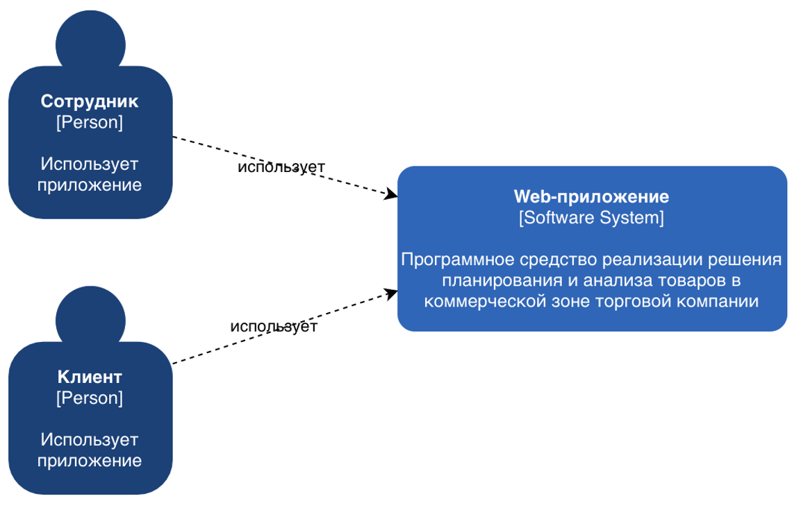
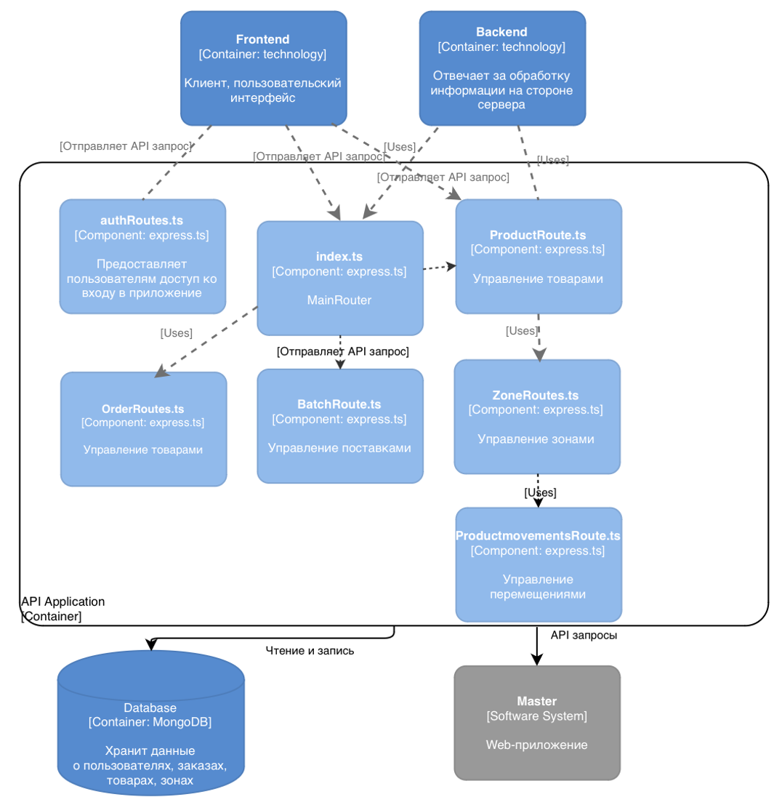
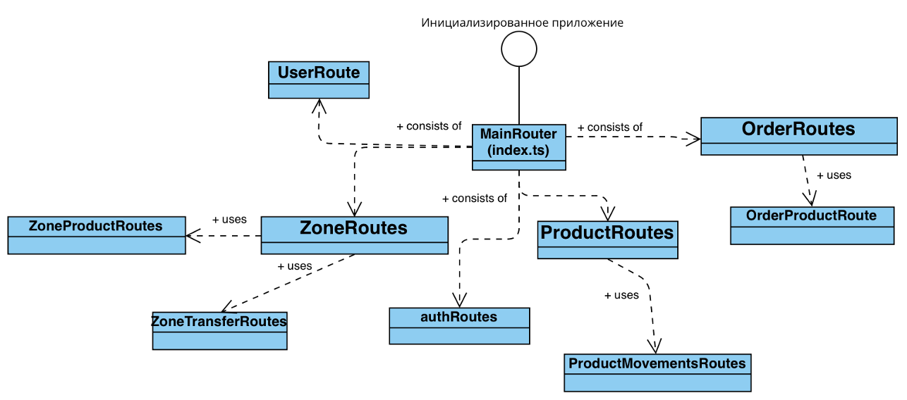
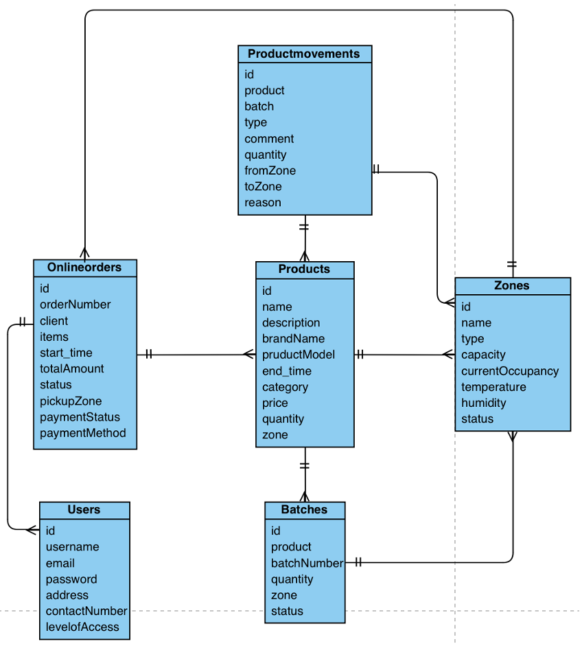
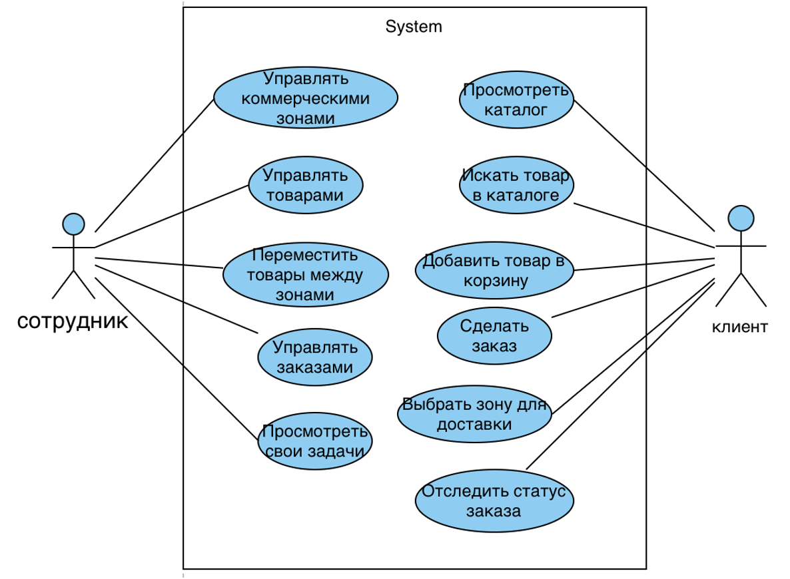
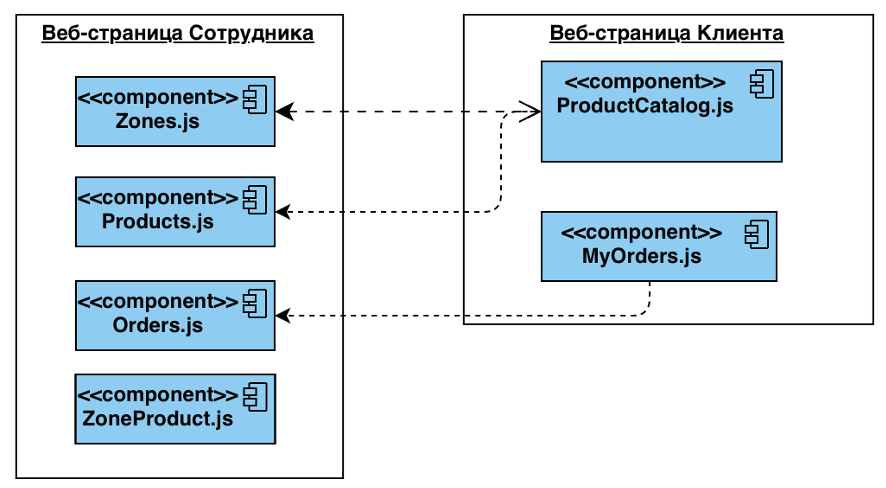

# **Программное средство автоматизация деятельности центра социального обслуживания в контексте цифровой трансформации социальной сферы**

Цель проекта — автоматизация процессов планирования ассортимента, анализа товарных запасов и продаж в коммерческих зонах торговой компании 
с целью повышения эффективности управления товарооборотом, оптимизации складских запасов и поддержки принятия управленческих решений.

Ссылки на репозитории:

Сервер: [https://github.com/hhaze17/DorakhavaAE_214371_RIOPK_Server](https://github.com/hhaze17/DorakhavaAE_214371_RIOPK_Server)

Клиент: [https://github.com/hhaze17/DorakhavaAE_214371_RIOPK_Front](https://github.com/hhaze17/DorakhavaAE_214371_RIOPK_Front)

---

## **Содержание**

1. [Архитектура](#Архитектура)
2. [Функциональные возможности](#Функциональные_возможности)
3. [Детали реализации](#Детали_реализации)
4. [Тестирование](#Тестирование)
5. [Установка и  запуск](#installation)
6. [Лицензия](#Лицензия)
7. [Контакты](#Контакты)

---
## **Архитектура**

### C4-модель

#### Контекстный уровень


#### Контейнерный уровень


#### Компонентный уровень


#### Кодовый уровень


### Схема данных


```sql
-- Cкрипт для создания базы данных
import mongoose from 'mongoose';
import 'dotenv/config';
import bcrypt from 'bcryptjs';
import { faker } from '@faker-js/faker';
import { faker as fakerRU } from '@faker-js/faker/locale/ru';

import Product from '../models/Product';
import Zone from '../models/Zone';
import User from '../models/User';
import Batch from '../models/Batch';
import ProductMovement from '../models/ProductMovement';
import OnlineOrder from '../models/OnlineOrder';
import { ZoneInterface, ProductInterface, BatchInterface, UserInterface } from '../types';

const randomDate = (start: Date, end: Date) => new Date(start.getTime() + Math.random() * (end.getTime() - start.getTime()));
const getRandomElement = <T>(arr: T[]): T => arr[Math.floor(Math.random() * arr.length)];
const getRandomElements = <T>(arr: T[], count: number): T[] => [...arr].sort(() => 0.5 - Math.random()).slice(0, count);

const USERS_COUNT = 30;
const PRODUCTS_COUNT = 30;
const BATCHES_COUNT = 40;
const ORDERS_COUNT = 15;

async function createZones() {
  const zones = [
    { name: 'Торговый зал Центральный', type: 'sales', capacity: 500, currentOccupancy: 280, temperature: 22, humidity: 45, status: 'active', salesZoneConfig: { minStockThreshold: 5, isPromoZone: false, displayPriority: 1, visibleToCustomer: true } },
    { name: 'Торговый зал Электроника', type: 'sales', capacity: 300, currentOccupancy: 150, temperature: 21, humidity: 40, status: 'active', salesZoneConfig: { minStockThreshold: 3, isPromoZone: false, displayPriority: 2, visibleToCustomer: true } },
    { name: 'Промо-зона Акций', type: 'sales', capacity: 120, currentOccupancy: 85, temperature: 22, humidity: 45, status: 'active', salesZoneConfig: { minStockThreshold: 2, isPromoZone: true, promotionEndDate: new Date(Date.now() + 15 * 24 * 60 * 60 * 1000), displayPriority: 1, visibleToCustomer: true } },
    { name: 'Основной склад', type: 'warehouse', capacity: 2000, currentOccupancy: 1450, temperature: 18, humidity: 50, status: 'active', warehouseConfig: { temperatureMonitored: true, storageConditions: { specialRequirements: 'Нет особых требований' }, fifoEnabled: true, zonePartition: 'Общее хранение', allowMixedProducts: true } },
    { name: 'Склад электроники', type: 'warehouse', capacity: 800, currentOccupancy: 350, temperature: 20, humidity: 35, status: 'active', warehouseConfig: { temperatureMonitored: true, storageConditions: { specialRequirements: 'Низкая влажность' }, fifoEnabled: true, zonePartition: 'Электроника', allowMixedProducts: true } },
    { name: 'Холодильный склад', type: 'warehouse', capacity: 500, currentOccupancy: 230, temperature: 4, humidity: 65, status: 'active', warehouseConfig: { temperatureMonitored: true, storageConditions: { specialRequirements: 'Температура 2-6°C' }, fifoEnabled: true, zonePartition: 'Охлаждённые продукты', allowMixedProducts: false } },
    { name: 'Морозильный склад', type: 'warehouse', capacity: 300, currentOccupancy: 180, temperature: -18, humidity: 60, status: 'active', warehouseConfig: { temperatureMonitored: true, storageConditions: { specialRequirements: 'Температура -20°C до -16°C' }, fifoEnabled: true, zonePartition: 'Замороженные продукты', allowMixedProducts: false } },
    { name: 'Зона приемки Центральная', type: 'receiving', capacity: 300, currentOccupancy: 85, temperature: 20, humidity: 55, status: 'active', receivingConfig: { hasQualityControl: true, maxDailyCapacity: 500, requiresInspection: true, supplierVerification: true, tempStorageDuration: 24 } },
    { name: 'Кассовая зона Центральная', type: 'cashier', capacity: 100, currentOccupancy: 35, temperature: 22, humidity: 45, status: 'active', cashierConfig: { hasReturnsProcessing: true, hasExpressCheckout: true, realTimeInventoryUpdate: true, allowPartialReturn: true } },
    { name: 'Зона возвратов', type: 'returns', capacity: 200, currentOccupancy: 75, temperature: 20, humidity: 50, status: 'active', returnsConfig: { requiresInspection: true, maxStorageDays: 30, allowReselling: true, defectCategories: ['minor', 'major', 'critical'], quarantinePeriod: 7 } },
    { name: 'Зона выдачи заказов №1', type: 'pickup', capacity: 150, currentOccupancy: 60, temperature: 21, humidity: 45, status: 'active', pickupConfig: { maxWaitingTime: 48, requiresIdentification: true, notificationEnabled: true, reservationDuration: 72, statusTracking: true } }
  ];
  return await Zone.create(zones);
}

async function createUsers() {
  const passwordHash = await bcrypt.hash('123456', 10);
  const now = new Date();
  const users = [
    { username: 'admin', password: passwordHash, firstName: 'Админ', lastName: 'Главный', name: 'Админ Главный', email: 'admin@warehouse.by', contactNumber: '+375291234567', address: 'г. Минск, ул. Независимости, д. 1', birthDate: new Date(1980, 1, 1), levelOfAccess: 'Администратор', isActive: true, createdAt: now, updatedAt: now },
    { username: 'employee', password: passwordHash, firstName: 'Сотрудник', lastName: 'Иванов', name: 'Сотрудник Иванов', email: 'employee@warehouse.by', contactNumber: '+375291112233', address: 'г. Минск, ул. Пушкина, д. 2', birthDate: new Date(1990, 5, 15), levelOfAccess: 'Сотрудник', isActive: true, createdAt: now, updatedAt: now },
    { username: 'client', password: passwordHash, firstName: 'Клиент', lastName: 'Петров', name: 'Клиент Петров', email: 'client@warehouse.by', contactNumber: '+375292223344', address: 'г. Минск, ул. Якуба Коласа, д. 3', birthDate: new Date(1995, 10, 20), levelOfAccess: 'Клиент', isActive: true, createdAt: now, updatedAt: now }
  ];
  for (let i = 0; i < USERS_COUNT - 3; i++) {
    const firstName = fakerRU.person.firstName();
    const lastName = fakerRU.person.lastName();
    users.push({
      username: fakerRU.internet.userName().toLowerCase(),
      password: passwordHash,
      firstName,
      lastName,
      name: `${firstName} ${lastName}`,
      email: fakerRU.internet.email(),
      contactNumber: fakerRU.phone.number('+37529#######'),
      address: `г. ${fakerRU.location.city()}, ул. ${fakerRU.location.street()}, д. ${fakerRU.number.int({min:1,max:100})}`,
      birthDate: fakerRU.date.birthdate({ min: 1970, max: 2003, mode: 'year' }),
      levelOfAccess: i % 3 === 0 ? 'Администратор' : (i % 3 === 1 ? 'Сотрудник' : 'Клиент'),
      isActive: true,
      createdAt: fakerRU.date.past(),
      updatedAt: now
    });
  }
  return await User.create(users);
}

async function createProducts(zones: ZoneInterface[]): Promise<ProductInterface[]> {
  const categories = [
    'Смартфоны', 'Ноутбуки', 'Телевизоры', 'Планшеты', 'Мониторы', 'Наушники', 'Колонки', 'Роутеры',
    'Фотоаппараты', 'Видеорегистраторы', 'Умные часы', 'Проекторы', 'SSD', 'HDD', 'Видеокарты',
    'Процессоры', 'Материнские платы', 'Блоки питания', 'Корпуса', 'Мыши', 'Клавиатуры',
    'Моноблоки', 'Серверы', 'Сетевое оборудование', 'Аксессуары'
  ];
  const brands = [
    'Samsung', 'Xiaomi', 'Apple', 'Realme', 'LG', 'Philips', 'Sony', 'Huawei', 'Honor', 'Lenovo',
    'HP', 'Dell', 'Asus', 'Acer', 'MSI', 'Kingston', 'WD', 'Seagate', 'TP-Link', 'Logitech',
    'A4Tech', 'Gembird', 'Canon', 'Nikon', 'JBL', 'Beats', 'Razer', 'Corsair', 'Gigabyte', 'Zyxel'
  ];
  const products: any[] = [];
  let productIdCounter = 10001;

  const allowedZones = zones.filter((z: ZoneInterface) => z.type === 'sales' || z.type === 'warehouse');

  for (let i = 0; i < PRODUCTS_COUNT; i++) {
    const category = getRandomElement(categories);
    const brand = getRandomElement(brands);
    const zone = getRandomElement(allowedZones);
    if (!zone || !zone._id) {
      throw new Error('Не удалось определить зону для продукта!');
    }
    const price = Math.floor(Math.random() * 4801) + 200; // 200-5000 BYN
    const productModel = `${brand} ${fakerRU.string.alphanumeric(4).toUpperCase()}`;
    const description = `Оригинальный ${category.toLowerCase()} ${brand} — современное устройство с отличными характеристиками, идеально подходит для работы и развлечений. Гарантия 12 месяцев.`;
    const product = {
      productId: (productIdCounter++).toString(),
      name: `${brand} ${category} ${fakerRU.string.alphanumeric(3).toUpperCase()}`,
      description,
      brandName: brand,
      productModel,
      model: productModel,
      category,
      price,
      pricePerUnit: `${price.toFixed(2)} BYN`,
      quantity: Math.floor(Math.random() * 91) + 10,
      zone: zone._id,
      storageConditions: {
        temperature: zone.temperature,
        humidity: zone.humidity,
        lightSensitive: false
      },
      batchInfo: {
        batchNumber: 'B' + fakerRU.string.numeric(6),
        manufacturingDate: randomDate(new Date(Date.now() - 180 * 24 * 60 * 60 * 1000), new Date(Date.now() - 10 * 24 * 60 * 60 * 1000)),
        expiryDate: randomDate(new Date(Date.now() + 180 * 24 * 60 * 60 * 1000), new Date(Date.now() + 730 * 24 * 60 * 60 * 1000))
      },
      status: Math.random() > 0.1 ? 'active' : 'inactive',
      isPromotion: Math.random() > 0.8,
      promotionEndDate: Math.random() > 0.8 ? randomDate(new Date(), new Date(Date.now() + 30 * 24 * 60 * 60 * 1000)) : undefined
    };
    products.push(product);
  }
  const created = await Product.create(products);
  return created as ProductInterface[];
}

async function createBatches(products: ProductInterface[], zones: ZoneInterface[]): Promise<BatchInterface[]> {
  const batches: any[] = [];
  for (let i = 0; i < BATCHES_COUNT; i++) {
    const product: ProductInterface = getRandomElement(products);
    const zone: ZoneInterface = getRandomElement(zones.filter((z: ZoneInterface) => z.type === 'warehouse')) || getRandomElement(zones);
    const batch = {
      product: product._id,
      batchNumber: 'B' + faker.string.numeric(6),
      quantity: Math.floor(Math.random() * 50) + 10,
      manufacturingDate: randomDate(new Date(Date.now() - 180 * 24 * 60 * 60 * 1000), new Date(Date.now() - 10 * 24 * 60 * 60 * 1000)),
      expiryDate: randomDate(new Date(Date.now() + 10 * 24 * 60 * 60 * 1000), new Date(Date.now() + 365 * 24 * 60 * 60 * 1000)),
      zone: zone._id,
      status: Math.random() > 0.1 ? 'active' : 'expired',
      supplier: { name: faker.company.name(), contact: faker.phone.number() },
      purchasePrice: Math.floor(Math.random() * 500) + 50,
      notes: Math.random() > 0.8 ? faker.lorem.sentence() : undefined
    };
    batches.push(batch);
  }
  const created = await Batch.create(batches);
  return created as BatchInterface[];
}

async function createProductMovements(batches: BatchInterface[], zones: ZoneInterface[], users: UserInterface[]): Promise<void> {
  const types = ['receipt', 'transfer', 'sale', 'return', 'adjustment', 'writeoff', 'online_order', 'pickup', 'expired'];
  const movements: any[] = [];
  for (const batch of batches) {
    const product = batch.product;
    const fromZone: ZoneInterface = getRandomElement(zones);
    const toZone: ZoneInterface = getRandomElement(zones);
    const type = getRandomElement(types);
    const user: UserInterface = getRandomElement(users);
    movements.push({
      product,
      batch: batch._id,
      type,
      quantity: Math.floor(Math.random() * batch.quantity) + 1,
      fromZone: fromZone._id,
      toZone: toZone._id,
      performedBy: user._id,
      reason: faker.lorem.words(3),
      expiryDate: batch.expiryDate
    });
  }
  await ProductMovement.create(movements);
}

async function createOnlineOrders(products: ProductInterface[], zones: ZoneInterface[], users: UserInterface[]): Promise<void> {
  const pickupZones = zones.filter((z: ZoneInterface) => z.type === 'pickup');
  const clients = users.filter((u: UserInterface) => u.levelOfAccess === 'Клиент');
  const validProducts = products.filter(p => typeof p.price === 'number' && !isNaN(p.price) && p.price >= 0);

  for (let i = 0; i < ORDERS_COUNT; i++) {
    const client: UserInterface = getRandomElement(clients);

    const orderProducts = getRandomElements(validProducts, Math.floor(Math.random() * 3) + 1);

    const items = orderProducts.map((product: ProductInterface) => {
      const quantity = Math.floor(Math.random() * 3) + 1;
      return {
        product: product._id,
        quantity,
        price: product.price,
        // batch и zone можно добавить, если нужно
      };
    });
    if (!items.length) continue;

    const totalAmount = items.reduce((sum: number, item: any) => {
      if (typeof item.price === 'number' && typeof item.quantity === 'number' && !isNaN(item.price) && !isNaN(item.quantity)) {
        return sum + item.price * item.quantity;
      }
      return sum;
    }, 0);
    if (!isFinite(totalAmount) || isNaN(totalAmount)) continue;

    await OnlineOrder.create({
      orderNumber: 'ORD-' + faker.string.numeric(6),
      client: client._id,
      items,
      totalAmount,
      status: getRandomElement(['pending', 'confirmed', 'processing', 'ready', 'completed', 'cancelled']),
      pickupZone: getRandomElement(pickupZones)?._id,
      pickupTime: randomDate(new Date(), new Date(Date.now() + 30 * 24 * 60 * 60 * 1000)),
      paymentStatus: getRandomElement(['pending', 'paid', 'failed', 'refunded']),
      paymentMethod: getRandomElement(['card', 'cash', 'transfer']), // обязательно!
      reservedProducts: items.map((item: any) => item.product),
      notes: Math.random() > 0.7 ? faker.lorem.sentence() : undefined
    });
  }
}

const fullInitDatabase = async () => {
  try {
    mongoose.set('strictQuery', false);
    await mongoose.connect('mongodb://localhost:27017/warehouse2');
    console.log('Connected to database successfully ✅');
    await User.deleteMany({});
    await Product.deleteMany({});
    await Zone.deleteMany({});
    await Batch.deleteMany({});
    await ProductMovement.deleteMany({});
    await OnlineOrder.deleteMany({});
    const users = await createUsers();
    const zones = await createZones();
    const products = await createProducts(zones);
    const batches = await createBatches(products, zones);
    await createProductMovements(batches, zones, users);
    await createOnlineOrders(products, zones, users);
    console.log(`\n=== СТАТИСТИКА ===`);
    console.log(`Пользователи: ${await User.countDocuments()}`);
    console.log(`Зоны: ${await Zone.countDocuments()}`);
    console.log(`Товары: ${await Product.countDocuments()}`);
    console.log(`Партии: ${await Batch.countDocuments()}`);
    console.log(`Движения: ${await ProductMovement.countDocuments()}`);
    console.log(`Онлайн-заказы: ${await OnlineOrder.countDocuments()}`);
    console.log('\n=== БАЗА ДАННЫХ УСПЕШНО ИНИЦИАЛИЗИРОВАНА! ===\n');
    process.exit(0);
  } catch (error) {
    console.error('Ошибка инициализации базы данных ❌', error);
    process.exit(1);
  }
};

fullInitDatabase(); 
```
---

## **Функциональные возможности**

### Диаграмма вариантов использования


### User-flow диаграмма


---

## **Детали реализации**

### UML-диаграммы

#### Диаграмма компонентов


### Спецификация API

API-документация доступна по адресу: http://localhost:8081/api-docs.

| Эндпоинт                      | Описание                              |
| ----------------------------- | ------------------------------------- |
| `POST /api/user/register`     | Регистрация пользователя              |
| `POST /api/user/login`        | Аутентификация и получение JWT токена |
| `GET /api/products`           | Получение списка всех товаров         |
| `POST /api/products`          | Добавление нового товара              |
| `PUT /api/products/{id}`      | Обновление информации о товаре        |
| `DELETE /api/products/{id}`   | Удаление товара по ID                 |
| `GET /api/zones`              | Получение списка зон                  |
| `POST /api/zones`             | Создание новой зоны                   |
| `POST /api/product-movements` | Перемещение товара между зонами       |
| `GET /api/orders`             | Получение заказов пользователя        |
| `POST /api/orders`            | Создание нового заказа                |


### Безопасность

- Аутентификация реализована с использованием логина и пароля, введённых пользователем. Процесс включает:
- проверку наличия пользователя в базе данных по имени пользователя;
- сравнение введённого пароля с захешированным с использованием bcrypt;
- генерацию JWT-токена с использованием секретного ключа, установленного в .env (JWT_SECRET).
Пример генерации токена:
```
const generateToken = (id: string): string => {
  return jwt.sign({ id }, process.env.JWT_SECRET as string, {
    expiresIn: '30d'
  });
};
```
Для защиты маршрутов и данных реализованы middleware-функции:
- АuthMiddleware – проверяет наличие и корректность JWT-токена, извлекает ID пользователя и загружает его из базы данных. Если пользователь не найден или токен недействителен – запрос отклоняется.
   СheckRole([‘client, ‘employee’]) – проверяет, имеет ли текущий пользователь необходимый уровень доступа к защищённому ресурсу. Поддерживаются уровни: employee, client.
Пример использования:
```
app.get('/api/admin-only', authMiddleware, checkRole(['admin']), handler);
```
Защита паролей:
- все пароли хранятся в захешированном виде с помощью библиотеки bcryptjs;
- при регистрации и смене пароля используется соление (salt) и повторная генерация хеша;
- ни в одном ответе сервера пароли не передаются – они исключаются с помощью .select('-password').


### Оценка качества кода

- Function Length: большинство функций содержат от 5 до 30 строк, соблюдая принцип единичной ответственности. 
- Code Duplication: дублирование сведено к минимуму благодаря использованию переиспользуемых компонентов, middleware и схем Mongoose.
- Cyclomatic Complexity: средняя цикломатическая сложность функций – 4-7, что говорит о разумной логике и отсутствии перегруженности.
- Test Coverage: покрытие интерфейса (React-компонентов) достигает ~70% (по данным Jest), что обеспечивает проверку основных сценариев взаимодействия пользователя с системой.
- Code Style Consistency: код форматируется при помощи Prettier, а ESLint помогает соблюдать единый стиль.
- Наличие документации и типизации: все модели, запросы и функции типизированы; в сложных участках добавлены комментарии.

---

## **Тестирование**

### Unit-тесты

Unit-тестирование (модульное тестирование) – это методика, при которой тестируется отдельная, изолированная часть программы (обычно – один метод или класс). 

- @testing-library/react	Рендерит компонент и имитирует действия пользователя
- jest.mock(...)		Подменяет реальные модули (API, маршруты, localStorage)
- BrowserRouter	Обеспечивает маршрутизацию внутри теста (для React Router)
- waitFor	Ожидает асинхронные действия, например, загрузку данных
- fireEvent	Симулирует ввод текста, клики и т.п

Реализованный тест для товаров имитирует ввод текста "Model X" в строку поиска и проверяет, что отображается только нужный товар (Test Product 1).
```
test('filters products by search term', async () => {
    render(
      <BrowserRouter>
        <Products />
      </BrowserRouter>
    );
    
    await waitFor(() => {
      expect(screen.queryByRole('progressbar')).not.toBeInTheDocument();
    });
    
    // Type in search box
    const searchInput = screen.getByPlaceholderText('Поиск товаров...') || 
                        screen.getByLabelText('Поиск') ||
                        screen.getByRole('textbox');
    
    fireEvent.change(searchInput, { target: { value: 'Model X' } });
    
    // Check if only matching product is displayed
    expect(screen.getByText('Test Product 1')).toBeInTheDocument();
    expect(screen.queryByText('Test Product 2')).not.toBeInTheDocument();
    expect(screen.queryByText('Test Product 3')).not.toBeInTheDocument();
  });
```
Данный тест выбирает фильтр категории Electronics и проверяет, что отображаются только товары из этой категории (1 и 3).
```
  test('filters products by category', async () => {
    render(
      <BrowserRouter>
        <Products />
      </BrowserRouter>
    );
    
    await waitFor(() => {
      expect(screen.queryByRole('progressbar')).not.toBeInTheDocument();
    });
    
    // Select category filter
    const categorySelect = screen.getByLabelText('Категория') || 
                           screen.getAllByRole('combobox')[0];
    
    fireEvent.change(categorySelect, { target: { value: 'Electronics' } });
    
    // Check if only Electronics products are displayed
    expect(screen.getByText('Test Product 1')).toBeInTheDocument();
    expect(screen.queryByText('Test Product 2')).not.toBeInTheDocument();
    expect(screen.getByText('Test Product 3')).toBeInTheDocument();
  });
```

---

## **Установка и  запуск**

Необходимые программы и компоненты. Для успешной установки и запуска веб-приложения Food Delivery Master необходимо наличие следующих компонентов:
- операционная система семейства MacOS или Windows;
- веб-сервер Express.js;
- зависимости (библиотеки) для серверной части приложения;
- клиентская часть React.js;
- зависимости (библиотеки);
- сервер базы данных ModngoDB.
Последовательность установки. Для установки разработанного программного средства необходимо выполнить следующие шаги:
- Подготовка среды для запуска фронтенда: скачать последнюю версию редактора Visual Studio Code с официального сайта. 
- Установить и настроить Node.js.
- Установить зависимости для серверной части.
- Установить зависимости для клиентской части.
- Установить и настроить сервер баз данных MongoDB, для удобства можно также использовать MongoDB Compass.
- Установить и настроить разработанное ПС.
Состав дистрибутива. В поставляемый конечному пользователю дистрибутив входят следующие элементы:
- скрипт генерации пустой базы данных;
- ярлык, содержащий ссылку на сайт.
Проверка работоспособности. Для проверки работоспособности веб-приложения необходимо:
- убедиться в том, что сервис MongoDB запущен;
- убедиться в том, что сервер веб-приложения запущен;
- убедиться в том, что клиентская часть веб-приложения запущена;
- используя любой интернет браузер перейти на адрес http://localhost:8081, где 8081 порт, указанный в файле сервера, или воспользоваться ярлыком.
В случае успеха в окне браузера откроется главная страница веб-приложения.
- Авторизация в системе: администратор создается автоматически с учётными данными:
Логин: admin
Пароль: 123456
Обычный пользователь создается при самостоятельной регистрации через интерфейс фронтенда.
- Запуск Unit-тестов: тесты написаны с использованием фреймворка xUnit. В открывшемся Обозревателе тестов выбрать нужные тесты или запустить все с помощью кнопки «Выполнить все тесты». 
После выполнения тестов, напротив каждого теста появится зеленая галочка. В случае неудачного теста отобразится красный крестик с описанием ошибки. 

---

## **Лицензия**

Этот проект лицензирован по лицензии MIT - подробности представлены в файле [License.md](LICENSE.md)

---

## **Контакты**

Автор: ari.dorokhova@gmail.com
